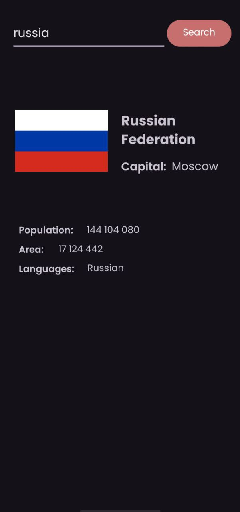

# InfoNation

InfoNation - это Android-приложение, которое предоставляет информацию о странах по их названию. Приложение использует API RestCountries для получения данных о странах: флаг, название, столицу, население, площадь, языки.

## Функции

- Поиск информации о стране по её названию
- Отображение названия страны, столицы, населения, площади и языков
- Загрузка и отображение флага страны

## Скриншоты

 
 


## Установка

1. Клонируйте репозиторий:

    ```sh
    git clone https://github.com/Rey5l/InfoNation_kt-app.git
    ```

2. Откройте проект в [Android Studio](https://developer.android.com/studio).

3. Установите приложение на ваше устройство:

    - Подключите ваше устройство к компьютеру через USB.
    - Перейдите в `Build` > `Build Bundle(s) / APK(s)` > `Build APK(s)`.
    - После завершения сборки найдите сгенерированный APK файл и перенесите его на ваше устройство.
    - Откройте APK файл на устройстве и следуйте инструкциям для установки.

## Использование

1. Запустите приложение.
2. Введите название страны в текстовое поле.
3. Нажмите кнопку поиска.
4. Просмотрите информацию о стране.

## Зависимости

- [Retrofit](https://square.github.io/retrofit/) для HTTP-запросов
- [Coil](https://github.com/coil-kt/coil) для загрузки изображений

## Авторы

- [Расул Назаралиев](https://github.com/Rey5l)

## Благодарности

- API данных о странах предоставлен [RestCountries](https://restcountries.com/).
- Иконки предоставлены [Flaticon](https://www.flaticon.com/).

